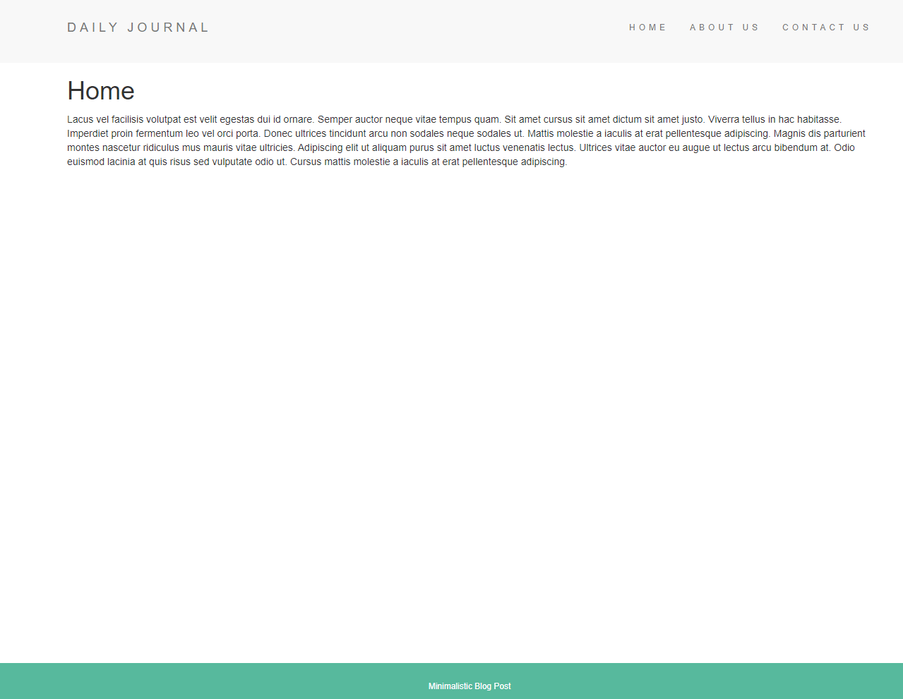

# 🌐 Awesome Daily News Blog 📰

Welcome to our Awesome Daily News Blog, a JavaScript-powered web application built with Node.js and EJS! 🚀

## 📝 Description

This blog is your go-to source for daily news, providing a seamless and delightful reading experience. Stay updated on the latest happenings in the world, all presented in a user-friendly format.

## 🛠️ Technologies Used

- **JavaScript**: The core language that powers both the frontend and backend.
- **Node.js**: A runtime that allows us to execute JavaScript on the server side.
- **EJS (Embedded JavaScript)**: Our templating engine for dynamically generating HTML content.

## 🚀 Getting Started

1. **Clone the Repository:**
   ```bash
   git clone https://github.com/your-username/awesome-daily-news-blog.git
   cd awesome-daily-news-blog
